# JE Labs 首页重设计方案 v2

> 重构范围：首页全部区块的视觉语言、信息密度、版式与动效。
> 不改：URL、锚点 ID、FAQ 结构化数据、品牌 logo。
> 设计 token 继承自 WeLike（`#06f5b7` / `surface-*` / Inter / 8px 按钮），见第 1 节。
> 本文所有示例图都是按 1440px 真实渲染出来的，不是示意草图。图片在 `img/` 目录，源文件在 `mock/`。

---

## 0. 先说判断

### 0.1 这个站在卖什么

一家给 AI / 前沿科技公司做定位、全球分发和生态运营的增长机构。买家是创始人和 CMO，他们在决定"要不要把预算交给这家"。这类决策只看两件事：**你做过谁，做出了什么数**。

现在的首页把这两件事排在第 9 屏和第 2 屏的小卡片里，前 8 屏全是自我描述。

### 0.2 现状体检（数字来自线上 index.html）


| 指标                        | 现状                                                     | 说明                                                            |
| ------------------------- | ------------------------------------------------------ | ------------------------------------------------------------- |
| 首页总高度                     | **14,272 px**                                          | 桌面端要滚 16 屏                                                    |
| 区块数                       | 12 个 section                                           | 每个都用同一种节奏                                                     |
| `.panel` 卡片数              | **40 个**                                               | 整页除了 2 张照片全是卡片                                                |
| 微标签（eyebrow + card-label） | **22 个**                                               | 每个区块顶上都挂一个小字标签                                                |
| h3 标题数                    | 26 个                                                   | 层级完全被稀释                                                       |
| 正文词数（不含 FAQ）              | **1,287 词**                                            | 一份 PPT 的量                                                     |
| 真实图片                      | 2 张 + 4 个头像                                            | 一个卖"能见度"的公司，页面上几乎没有视觉                                         |
| 字体家族                      | 3 套（Space Grotesk / Noto Sans KR / Cormorant Garamond） | 其中衬线体没有任何品牌理由，且和 WeLike 的 Inter 完全无关                          |
| 主色                        | `#00f5b8`                                              | **和 WeLike 在跑的 `#06f5b7` 不是同一个 hex**，配 `--accent-glow` 做按钮外发光 |
| 圆角                        | 16 / 24 / 32 三档混用 + 按钮全圆角                              | WeLike 全站 8px，两边毫无关系                                          |


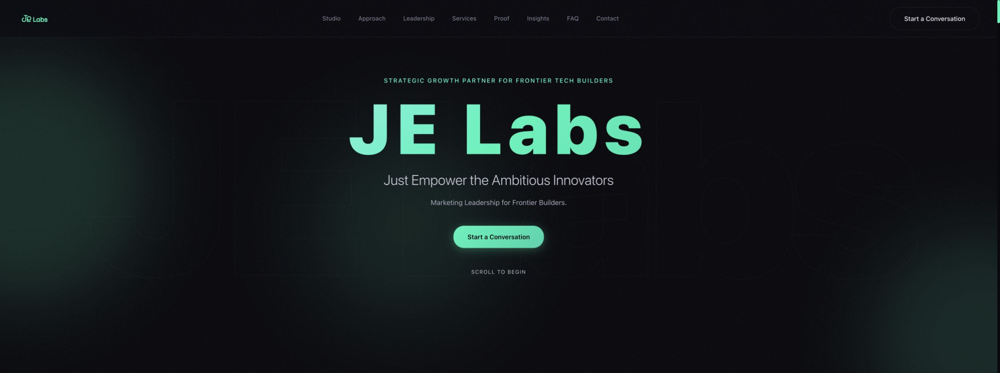

首屏的问题一句话说完：**它把 logo 当成了标题**。"JE Labs / Just Empower the Ambitious Innovators / Marketing Leadership for Frontier Builders" 是三句同义的口号，加上一行 eyebrow 和一个 "SCROLL TO BEGIN"，一共 5 段文字，没有一段告诉访客"你能拿到什么"。

再加上三个当前很典型的 AI 生成感信号：

1. **按钮外发光**（`--accent-glow`）。这是 2023 年 AI 建站模板的签名。
2. **背景两层径向渐变 + 一层线性渐变**叠出来的雾状底。
3. **"SCROLL TO BEGIN"**。用户已经在首屏了，他知道怎么滚。

### 0.3 重构模式

按 `design-taste-frontend` 的分类，这是 **Redesign - Overhaul**：视觉语言从零重建，但内容、信息架构和 SEO 资产全部保留。

一个额外约束：**设计 token 不由本方案发明，而是继承自 WeLike**（见第 1 节）。JE Labs 首页和 WeLike 产品共用一套品牌核，只在"营销层"上分歧。

三个刻度（dial）的取值：


| 刻度                 | 取值    | 理由                                            |
| ------------------ | ----- | --------------------------------------------- |
| `DESIGN_VARIANCE`  | **7** | 需要不对称、需要出血、需要留白差异；但它是 B2B 销售页，不是作品集，不能做到 9-10 |
| `MOTION_INTENSITY` | **6** | 滚动揭示、hover 图像揭示、视差、光标跟随。不做滚动劫持                |
| `VISUAL_DENSITY`   | **3** | 现状约等于 8。这是这次改动幅度最大的一项                         |


### 0.4 参考坐标系

分四层。**A 层是最重要的**：同赛道的增长机构，决定信息结构；B 层决定创意上限；C 层决定转化机制；D 层只贡献单点手法。

#### A. 同赛道：给科技/AI 公司做增长的机构（决定"页面该放什么"）


| 参考                              | 身份                                                                                | 借的是哪一条                                                                                                     |
| ------------------------------- | --------------------------------------------------------------------------------- | ---------------------------------------------------------------------------------------------------------- |
| **NoGood** (nogood.io)          | 纽约增长机构，客户 Nike / TikTok / MongoDB / Inflection AI。The Drum Awards、Shorty、Webby 获奖 | **最直接的对标**。首屏下方就是客户 logo 墙；每个案例 = 客户 logo + **具名高管证言** + 硬指标（879% / 75% / 149%）；有独立的**奖项徽章带**；FAQ 里直接写月费门槛 |
| **DEPT** (deptagency.com)       | Webby Awards **Network of the Year 2024 + 2025**                                  | 大体量机构如何在一页里同时讲创意、工程、增长而不散架                                                                                 |
| **Instrument** (instrument.com) | 波特兰数字品牌机构，客户 Salesforce / Stripe / ServiceNow                                     | 案例即首屏内容，大图叙事，正文极少                                                                                          |
| **Work & Co** (work.co)         | 产品设计机构                                                                            | 案例优先、几乎不写形容词的结构                                                                                            |


#### B. 创意上限：Awwwards 年度最佳（决定"能做到多好看"）


| 参考                                 | 奖项                                       | 借的是哪一条                                   |
| ---------------------------------- | ---------------------------------------- | ---------------------------------------- |
| **Igloo Inc**                      | Awwwards **Site of the Year 2024**       | WebGL 级别的沉浸叙事。**我们不做这个**，但它定义了行业天花板在哪    |
| **Noomo Agency** (noomoagency.com) | Awwwards **Site of the Year 2023**（机构官网） | 机构官网能拿年度最佳，靠的是把案例做成叙事而不是列表               |
| **Lusion v3** (lusion.co)          | Awwwards **Site of the Year 2023**       | 交互质感与材质感                                 |
| **Obys Agency** (obys.agency)      | Awwwards 常客，Awwwards 官方机构合集在列            | **大字排版实验 + 网格破格**，本方案 Work 索引的排版张力来自这一支  |
| **Locomotive** (locomotive.ca)     | Awwwards 获奖，蒙特利尔                         | **案例索引列表 + hover 图像揭示**，本方案 Work 区块的直接原型 |
| **Active Theory v4**               | Awwwards **Site of the Year 2018**       | 机构作品集的动效编排                               |


#### C. 获客/转化：B2B 销售页（决定"怎么把访客变成线索"）


| 参考                              | 借的是哪一条                                                                 |
| ------------------------------- | ---------------------------------------------------------------------- |
| **Ramp** (ramp.com)             | 暗色专业调性建立可信度；等宽数字即版式；动效克制到"不打断阅读"。"Time is money. Save both." 是首屏文案的教科书 |
| **Attentive** (attentive.com)   | 结果型大标题 + 紧跟社会证明 + 低摩擦 CTA 的三段式                                         |
| **Superside** (superside.com)   | 设计服务如何用"交付物本身"当视觉素材                                                    |
| **Shopify JP** (shopify.com/jp) | 点阵地图上叠真实业务对象（你们自己给的参考）                                                 |


#### D. 单点手法（只借一条，不借整体）


| 参考                        | 借的是哪一条                                        |
| ------------------------- | --------------------------------------------- |
| **Squarespace**           | Webby 2025 **People's Voice 最佳文案**。短句、动词、零形容词 |
| **Linear** (linear.app)   | 64px 导航、单强调色纪律                                |
| **Mercury** (mercury.com) | 左文右图的非对称首屏比例                                  |
| **Stripe** (stripe.com)   | 复杂服务的渐进披露：左轨 + 右滚动                            |


> **说明**：Linear / Vercel / Stripe 这一支只保留了"导航高度、色彩纪律、渐进披露"这类**机制层**的东西。它们是开发者工具站，不是营销站，不该拿来定调性。上一版我把它们当主参考是错的。

---

## 1. 设计系统：与 WeLike 共享品牌核

WeLike 是 JE Labs 的产品，两个站必须看起来是同一家公司。但**产品 UI 系统不能整套搬到营销页上**：WeLike 是为信息密度、表单、表格优化的；营销页是为一眼说服优化的。整套搬过来，首页会长得像设置页。

所以分成两层：**品牌核共享，营销层分歧**，两边都不含糊。

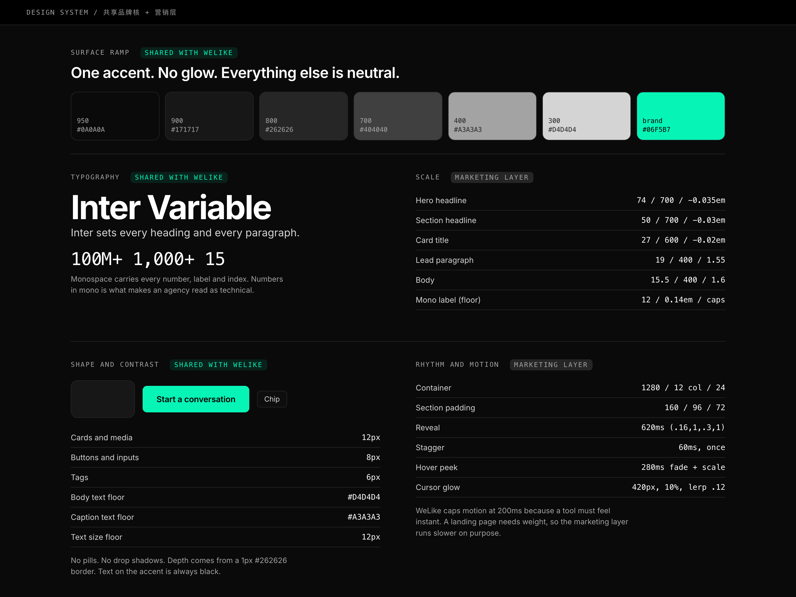

### 1.1 品牌核（与 WeLike 完全一致，不可单方面改）

以下数值来自 WeLike 实际在跑的代码（`apps/web/tailwind.config.ts` + `globals.css`），已对 welike-alpha.xyz 线上实测核对过：


| Token         | 值                                                       | 备注                                |
| ------------- | ------------------------------------------------------- | --------------------------------- |
| 主色            | `#06f5b7`                                               | hover `#1affb5`，pressed `#05c492` |
| 主色上的文字        | **永远黑色**                                                | 这个绿太亮，白字读不出来                      |
| 页面底色          | `#0a0a0a`                                               | surface-950                       |
| 卡片／输入框底       | `#171717`                                               | surface-900                       |
| 描边／分隔线        | `#262626`                                               | surface-800。**不用阴影**，深度全靠 1px 描边  |
| 结构性描边         | `#404040`                                               | surface-700                       |
| 标题／强调文字       | `#ffffff`                                               |                                   |
| 正文文字下限        | `#d4d4d4`                                               | surface-300，**不得更暗**              |
| 说明文字下限        | `#a3a3a3`                                               | surface-400，**不得更暗**              |
| `#737373` 及更暗 | 仅用于装饰                                                   | **任何可读文字都不许用**                    |
| 字体            | **Inter Variable**                                      | 标题正文都是它                           |
| 等宽            | `ui-monospace, SFMono-Regular, Menlo, Monaco, Consolas` | 所有数字、标签、索引                        |
| 卡片／图片圆角       | `12px`                                                  | rounded-xl                        |
| 按钮／输入框圆角      | `8px`                                                   | rounded-lg，**没有胶囊**               |
| 标签圆角          | `6px`                                                   | rounded-md                        |
| 最小字号          | **12px**                                                | 不许出现 10px / 11px                  |
| 图标库           | `lucide-react`                                          | 不混用其他图标集                          |


这套灰阶就是 Tailwind 的 `neutral`，所以两边都是 `surface-50 … surface-950`，代码层可以直接对齐。

### 1.2 营销层（与 WeLike 故意不同，且要写进文档）


| 维度       | WeLike（产品）                          | JE Labs 首页（营销）             | 为什么必须分开                  |
| -------- | ----------------------------------- | -------------------------- | ------------------------ |
| **信息密度** | Info-dense，"trust the user to read" | 正文砍 70%                    | 工作台里让用户读是对的，落地页里让用户读就是流失 |
| **字号上限** | 最大约 36px                            | Hero 74px                  | 同一个 Inter，不同字阶           |
| **字重**   | 600 为主                              | 标题 700                     | 大字需要更重的字面才压得住            |
| **动效**   | `transition-colors`，≤200ms，禁弹性缓动    | 620ms 滚动揭示 + hover 揭图 + 视差 | 工具要"快=跟手"，落地页要"慢=有分量"    |
| **发光**   | `.glow-brand` 限 hero CTA            | **归零**                     | 首页 CTA 压在照片上，发光会变成边缘色散   |
| **留白**   | `gap-6` / `p-6`                     | 区块 160 / 96 / 72           | 落地页靠留白建立层级               |


### 1.3 主色的用法（这才是"不刺眼"的解法）

`#06f5b7` 饱和度是 100%，直接铺大面积确实会晕。但正确解法是**限制用法**，不是改 hex（改 hex 只会让你们多出第四个薄荷绿：现在已经有 `#00f5b8`、`#06f5b7`、`kol-brand #2EDBA4` 三个了）。

主色只允许出现在五个地方：

1. 主 CTA 填充（黑字）
2. 链接和活跃状态
3. 等宽小标签（12px，面积极小）
4. 地图上的 3 个 hub 点
5. hover 时的行高亮

**明确禁止**：大面积背景填充、外发光、74px 大标题上色、每个 nav 项前面的小圆点。

### 1.4 这一层的收益

现状三套字体、三档圆角混用、无处不在的卡片描边，导致**页面上没有任何东西是突出的**。这一层不解决，改单个区块是白改。

数字走等宽是最高性价比的一处：一家技术增长机构，数字的排布方式就是它的可信度信号。

### 1.5 证据：Linear 和 Vercel 是怎么做的（实测）

#### Vercel（vercel.com 与 vercel.com/geist，实测对比


|      | vercel.com（营销）                  | vercel.com/geist（产品文档） |
| ---- | ------------------------------- | ---------------------- |
| 字体   | GeistSans                       | Geist                  |
| h1   | **64px / weight 400 / -0.06em** | **24px / weight 600**  |
| 按钮圆角 | **6px**                         | **6px**                |
| 按钮高度 | 40px                            | 32 / 36 / 40px         |


**同一套字、同一个圆角、同一组控件高度；只有标题字阶差了 40px。**

而且 Vercel 的设计系统 Geist 在官方文档里写得很直白：它提供的是 *"the colors, typography, materials, layout, and React components behind Vercel's products"*，一套系统覆盖它全部产品，没有"营销站另起一套"这回事。

#### 结论

Linear 和 Vercel 都是**一套 token 打通营销站和产品**，差异只出现在字阶、密度和动效上。所以 JE Labs 继承 WeLike 的品牌核不是妥协，是这两家正在做的事。

**参考**：WeLike 自己的 skill 写明参照系是 Linear / Vercel / Raycast，本方案同源。

---

## 2. Header 导航

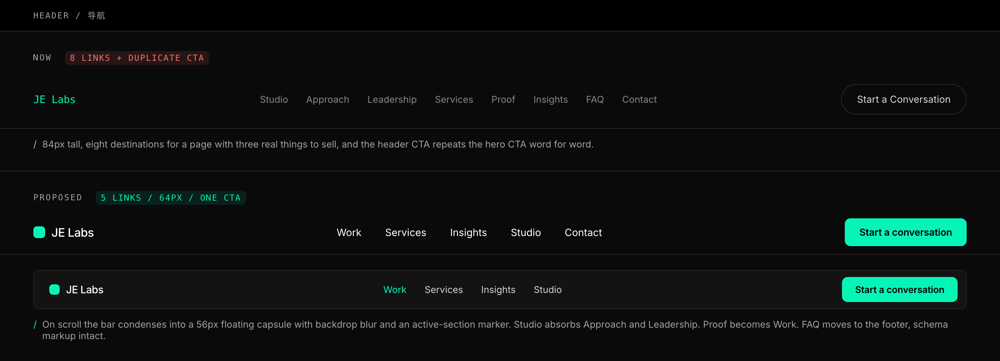

**现在的问题**

84px 高，8 个导航项（Studio / Approach / Leadership / Services / Proof / Insights / FAQ / Contact），右侧 ghost 按钮写的是 "Start a Conversation"，和首屏主按钮**一字不差**。8 个入口指向的其实只有 3 件事。

**改成什么**

- 高度 64px，5 个入口：**Work / Services / Insights / Studio / Contact**。
  - Studio 吸收 Approach 和 Leadership
  - Proof 改名 Work（对买家来说这是"案例"，不是"证据"）
  - FAQ 下沉到页脚（结构化数据原样保留）
- 右侧按钮改为实心主色，全站唯一的主 CTA 样式。
- 滚动后收成 56px 的浮动条（8px 圆角，与 WeLike 按钮同一档），带背景模糊和当前区块高亮。

**为什么**

导航项数量是信息架构的体检表。8 项说明内容没有被组织过，只是被罗列了。5 项之后，每一项背后都有真内容支撑。

高度从 84 降到 64，首屏可用高度多出 20px，在 900px 高的笔记本上这是实打实的。

**参考**：**NoGood**（导航直接暴露 Services / Results / About，把"证据"放进一级入口）、Linear（64px 高度与单 CTA 纪律）。

> **更正**：本文早前把 Work & Co 写成"4-5 项极简导航"，这是错的。实测 work.co 首页**根本没有顶部导航**：header 里只有 logo，而 logo 本身就是菜单按钮（`aria-label="Visit main navigation page"`，指向 `/grid`）。`/grid` 是一整页的案例网格，140 个链接，IKEA / Apple / Gatorade / Epic Games / Lyft 逐个平铺，**那一页就是导航**。传统的 7 项链接列表（Select Clients / Practice Areas / Outcomes / Process / Leadership / News & Insights / Careers）只出现在页脚。
>
> **这个模式 JE Labs 现在学不了，别学。** Work & Co 敢砍掉导航，是因为它有 40 个 Apple / IKEA 级别的案例，网格本身就是提案。你们只有 3 个案例，logo 后面没东西可放。
>
> 但它反过来印证了一条更重要的判断：**导航项的数量应该由"你有多少真内容"决定，不是由模板决定。** 你们现在 8 项对应 3 件真事，所以砍到 5 项；等案例攒到 15 个以上，再考虑把 Work 做成独立的索引页。

**⚠ SEO 红线**：锚点 ID（`#studio` `#approach` `#leadership` `#capabilities` `#proof` `#insights` `#faq` `#contact`）**全部保留**，即使导航不再直接指向它们。改名只改 label，不改 href 的 hash。

---

## 3. 第一屏 Hero

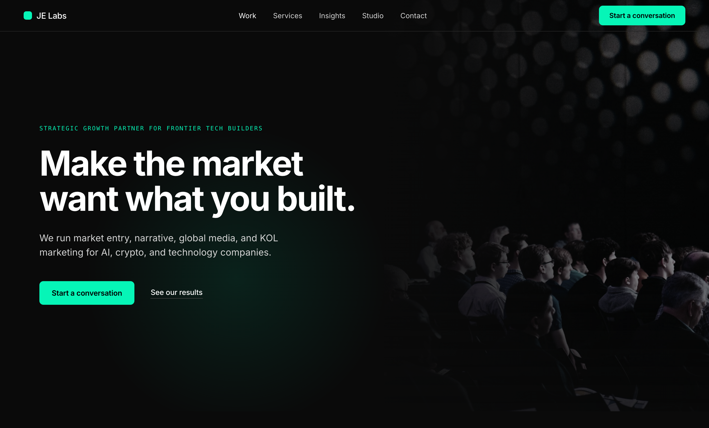

**现在的问题**

5 段文字（eyebrow / JE Labs / Just Empower... / Marketing Leadership... / SCROLL TO BEGIN），0 张图，0 个证据。背后还有一个巨大的 "JE Labs" 幽灵描边字。

**改成什么**

结构固定为 **4 个文字元素 + 1 张图**：

```
Strategic growth partner for frontier tech builders   ← 等宽小标签，沿用你们原有的这句
Make the market want what you built.                  ← 70px，2 行，结果
We run market entry, narrative, global media, and     ← 我们做什么
KOL marketing for AI, crypto, and technology companies.
[Start a conversation]   See our results              ← 一主一次
```

- 右侧 622px 媒体柱**满高出血到视口右缘**，只保留左侧圆角。用你们自己的开发者活动实拍照片，降饱和到 0.42、压亮度到 0.62，左侧压一层渐变遮罩让文字始终可读。
- 删掉幽灵大字、删掉 "SCROLL TO BEGIN"、删掉按钮外发光。
- 光标跟随的薄荷色光晕在这一屏生效（见第 13 节）。

### 3.1 三段各自承担什么

| 元素 | 任务 | 来源 |
|---|---|---|
| `Strategic growth partner for frontier tech builders` | **身份**。谁在说话 | 你们线上原句，未改 |
| `Make the market want what you built.` | **结果**。直接称呼读者 | 改写自你们线上 manifesto 原句 |
| `We run market entry, narrative, global media, and KOL marketing for AI, crypto, and technology companies.` | **做什么 + 给谁做** | 直接来自你们 FAQ 的服务清单 |

三段不重复主语：小标签是名词短语，主标题是动名词，副标题才用 "We"。上一版主标题和副标题都以 We 开头，读起来是两句同structure的话叠在一起。

### 3.2 为什么最后落在 "users"

上一版写的是 `We make frontier tech impossible to ignore.`，只说到"被看见"。**你们所有的成绩单都是获客口径**：

| 客户 | 结果 |
|---|---|
| SURF AI | +350% DAU，50 万+ 新注册 |
| PublicAI | 15+ 市场，本地媒体曝光 +300% |
| MOSS AI | 350% 活动 ROI，85% 目标开发者参与 |
| OKX Wallet（创始人履历） | 10M+ 全球用户 |

卖点必须和证据同口径，否则首屏和第 4 屏在讲两件事。`users` 是把这四行串起来的那个词。

### 3.3 副标题为什么这么排

你们 FAQ 原文是 26 个词：

> JE Labs 是一家战略增长工作室，致力于帮助前沿人工智能和科技公司优化市场定位、提升全球知名度，并构建可持续的生态系统，从而实现长期增长。

首屏放不下，也不该放。压缩规则是**只留动词和名词，砍掉所有目的状语**：

- 砍掉"致力于"、"从而实现长期增长"这类结果承诺，因为下面第 4 屏的数字会证明它
- 保留四个具体动作：市场进入、叙事、全球媒体、KOL 营销
- 客户类型按你说的改成 **AI, crypto, and technology companies**

一句话 16 词，三行内读完。

### 3.4 备选主标题（都不以 We 开头）

| 版本 | 说明 |
|---|---|
| `Make the market want what you built.` | **已采用**。改写自你们线上 manifesto 原句 "We turn technical credibility into **market desire**"。`what you built` 直接称呼读者，说中的是"东西做出来了，市场不认"这个真实的痛 |
| `Great technology does not market itself.` | 问题式开场，最有底气。缺点是整句否定式，首屏第一眼是个"不"字 |
| `Global users for frontier technology.` | 最短，纯结果。缺点是没有动词，像标语不像承诺，且 frontier 与小标签重复 |
| ~~`Turning technical products into users.`~~ | **已废弃**。语义不成立：`X turns into Y` 要求 X 和 Y 是同一个东西的两种状态，产品不会"变成"用户 |

### 3.5 两个要你们确认的点

**1. 小标签保持原句，不加"Your"。** 评估过 `Your strategic growth partner`，不建议：它丢掉了 `for frontier tech builders` 这个限定词，任何行业都能用，**失去筛选功能**；而且访客还是陌生人，"你的伙伴"是一个尚未成立的关系。原句同时也是你们现在 title 标签的内容，保留对 SEO 连续性最好。

想要"直接对着读者说话"的感觉，已经由主标题里的 `what you built` 承担了，效果比放在小标签里自然。

**2. crypto 要不要放到最前面。** 现在的顺序是 `AI, crypto, and technology companies`。你们 X 上的实际内容（MOSS 的 FAT Protocol、Arbitrum / BNB / Base / Ethereum、KOL 和大使计划）说明 crypto 的比重可能不低。**顺序即优先级**，谁排第一谁就是主战场，这个只有你们能定。

### 3.6 下一步：把副标题换成第三方引用（来自 work.co 实测）

Work & Co 首屏的副标题**不是自己写的话，是一句第三方引用**：

```
We solve complex problems through design & technology      ← 主张（自己说）

"Entrusted with digital product innovation by companies     ← 副标题（别人说）
 like Apple, Google, Nike."
        Fast Company
```

主标题自己说，**副标题让 Fast Company 替自己报客户名单**。这比"我们服务过 100+ 客户"强一个量级，因为说话的人换了。

等第 6 节的证言到位，副标题可以升级成这个结构：

```
Make the market want what you built.
"[客户高管或媒体原句，含具体结果]"
        姓名, 职位, 公司
```

**没拿到真实引用之前不要动**，先用现在这版功能性副标题。

**为什么**

- **"JE Labs" 不是标题，是 logo。** 它已经在左上角出现过一次了。首屏 96px 的黄金位置应该回答"你能给我什么"。
- **必须有图。** 一家卖能见度的公司，首屏不放任何视觉证据，本身就是反证。你们手里有真实活动照（`developer-activation-1200.webp`、`openclaw-stage-1200.webp`），真实感远超任何图库图。
- **出血到右缘**是这一屏唯一的"设计动作"：它打破了容器，让版面立刻脱离模板感，但不需要任何炫技。
- **标题必须 2 行以内**。3 行的大标题在 1440 屏上会把 CTA 挤出首屏。

**参考**：**Instrument**（首屏直接用真实项目影像，不用抽象图形）、**Ramp**（"Time is money. Save both." 式的短句首屏，主张先行）、**Squarespace**（Webby 2025 最佳文案：短句、动词、零形容词）、Mercury（左文右图的非对称比例）。

**⚠ 素材缺口**：`developer-activation-1200.webp` 右下角有"百度智能云"水印。示例图里我用位移裁掉了，落地时建议**重新导出无水印版本**，或换一张。

### 3.7 首屏图片：三种处理实测对比

原来那张图有三个问题：**中国面孔**（目标买家在欧美）、**底部硬切**（图片在首屏下沿断掉，留一条生硬的横线）、**四角圆角**（让它读作一张漂浮的卡片而不是出血）。

先看同类站怎么处理首屏媒体（全部实测）：

| 站 | 首屏媒体 | 处理 |
|---|---|---|
| **DEPT** | **无** | 白底，h1 112px，纯排版 |
| **Work & Co** | **无** | 白底，大字 + Fast Company 引用 |
| **Instrument** | 顶部一条视频带，**上边缘裁切** | 正式图片从 1546px 才开始（案例网格） |
| **NoGood** | 全幅装饰网格 + 居中动画 logo | **没有人物照片** |

**四家里三家的首屏没有任何人物照片。** 这本身就是一个答案。

于是做了三个方案：

| 方案 | 图 | 判断 |
|---|---|---|
| **A 无图排版** | 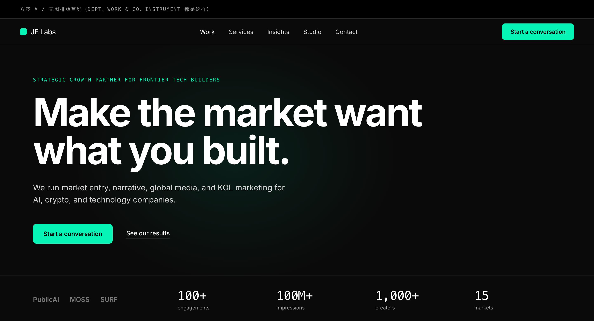 | 最接近同类站主流。94px 大字 + 信任带直接提到首屏内。零素材成本、零版权风险、加载最快。**但你们是做"能见度"的，首屏完全没有视觉会削弱说服力** |
| **B 全幅背景** | 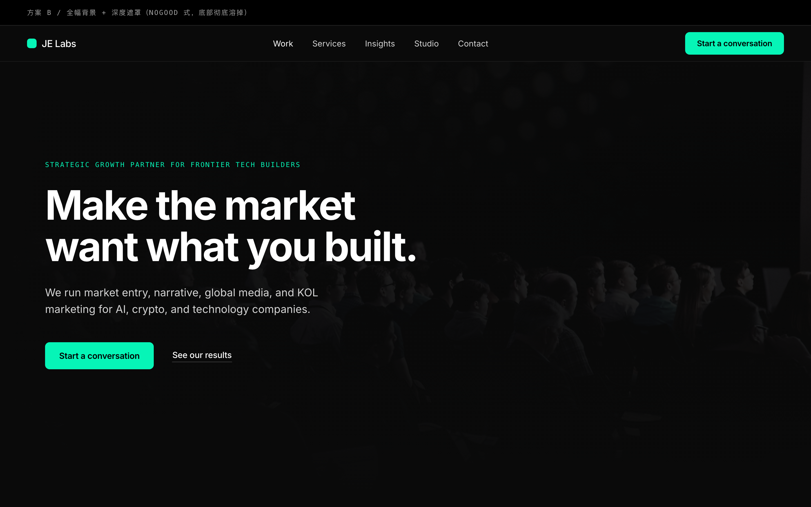 | 照片铺满首屏，遮罩从顶部 86% 压到底部 100% 纯色，**底部彻底溶进下一屏**。气氛最足，但文字压在照片上，长期看对比度维护成本高 |
| **C 右侧过渡（采用）** | 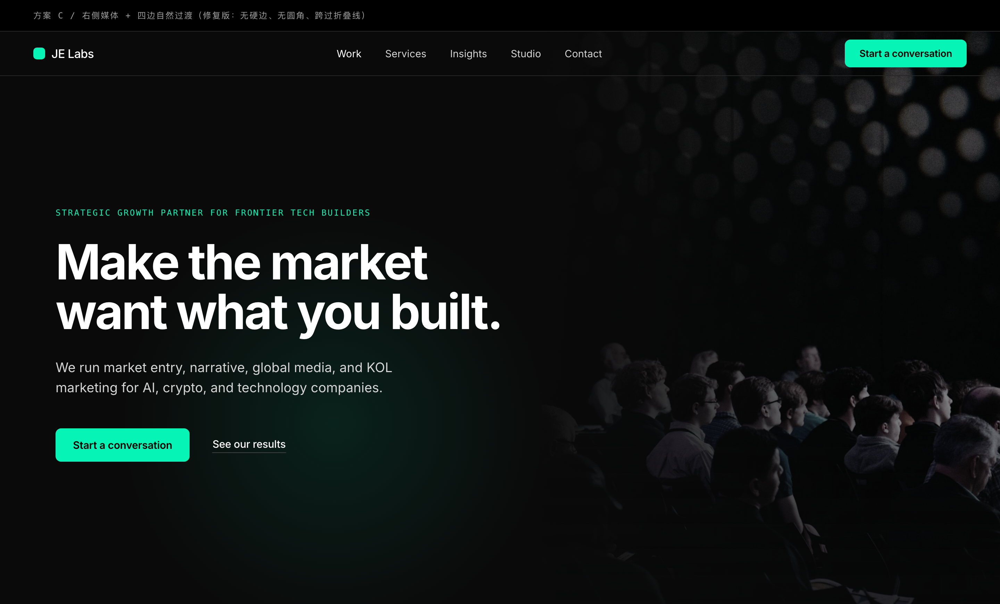 | 保留左文右图的结构，但**四条边全部做了过渡**：底部用 `mask-image` 渐变到透明、左边缘渐变融进底色、去掉圆角、图片高度 1000px 跨过折叠线。没有任何一条硬边 |

**C 的具体做法**

```css
.media {
  height: 1000px;        /* 比首屏高，越过折叠线，所以看不到底 */
  border-radius: 0;      /* 圆角 = 卡片感，出血不要圆角 */
  mask-image: linear-gradient(180deg, #000 0%, #000 58%,
                              rgba(0,0,0,.35) 82%, transparent 97%);
}
.media::after {          /* 左边缘融进页面底色 */
  background: linear-gradient(94deg, #0a0a0a 0%, rgba(10,10,10,.72) 26%,
                              rgba(10,10,10,.12) 68%, transparent 100%);
}
```

**照片本身**：换成了欧美会议观众的实拍，暗调、逆光、人物是背影和侧脸。选背影是有意的：**不出现清晰正脸，就不会让人误以为"这是 JE Labs 的某场活动"**。

**⚠ 版权与真实性**：这张是 Unsplash 图库照片（可商用），**不是你们的活动**。放在首屏当氛围图可以，但**绝不能配"我们的活动"这类说明文字**。你们真实的活动照（上海、首尔）应该留给案例区块用，那里需要的正是"这确实是我们做的"。

---

## 4. 信任带 Proof（只留 logo 墙）

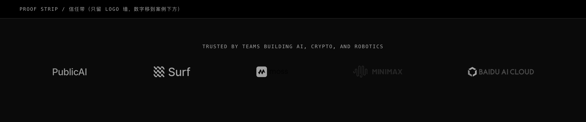

**现在的问题**

首屏下方是 4 个一模一样的 `.stat-card`，每张卡带描边、带 eyebrow、带一句 20 词的说明。卡片的存在只是为了填满一行。

**改成什么**

只保留一行：一句资格认定 + 客户 logo 墙。

- `Trusted by teams building AI, crypto, and robotics` 一句话，等宽小字，居中
- PublicAI / Surf / MOSS / MiniMax / Baidu AI Cloud，统一降到 62% 不透明度、去色
- **原来的 4 个聚合数字已移到案例区块下方**（见第 6 节）

**为什么把数字挪走**

这是实测两个同类站之后的结论：

| 站 | 首屏之后第一个数字出现在哪 |
|---|---|
| **NoGood** | **y = 8479px**，在案例卡里（879% / 75% / 149%）。在那之前整页没有任何数字，只有 y≈1078 的 logo 墙 |
| **Attentive** | 每个品牌自己的数字（97倍 / 48%），紧贴该品牌的图和引言 |

**两家都没有"聚合数字带"这个东西，所有数字都长在具体案例上。**

三条理由：

1. **聚合数字是案例数字的总和，摘要应该在细节之后。** `100+ engagements` 出现在你还没看到任何一个 engagement 之前，就是一句没有支撑的断言。
2. **原来的顺序是"数字 → 方法论 → 数字"**，中间夹一个方法论，把刚建立的叙事流（身份 → 怎么做 → 做出了什么）打断了。
3. 移到案例下方形成**递进**：三个具体成果，然后"这样的合作总共 100+ 次、1 亿+ 曝光、1000+ 创作者、15 个市场"。同时给 Results 区块一个自然的收尾，不再是第三个案例讲完就断掉。

**代价要说清楚**：第二屏现在只有 logo 墙，比较薄，访客要滚过方法论才看到第一个数字。对一个"数字就是产品"的机构，这是真实成本。**但 NoGood 恰恰接受了这个成本**，它的第一个数字在 8479px。用一句资格认定行把第二屏的分量补回来。

**参考**：**NoGood**（首屏正下方只有 logo 墙 + 一句 "Trusted partner to leading startups, scaleups, and Fortune 100 brands"）、**Attentive**（logo 墙在前，数字跟着具体品牌走）。

---

## 5. 方法论 Approach（新的第二屏）

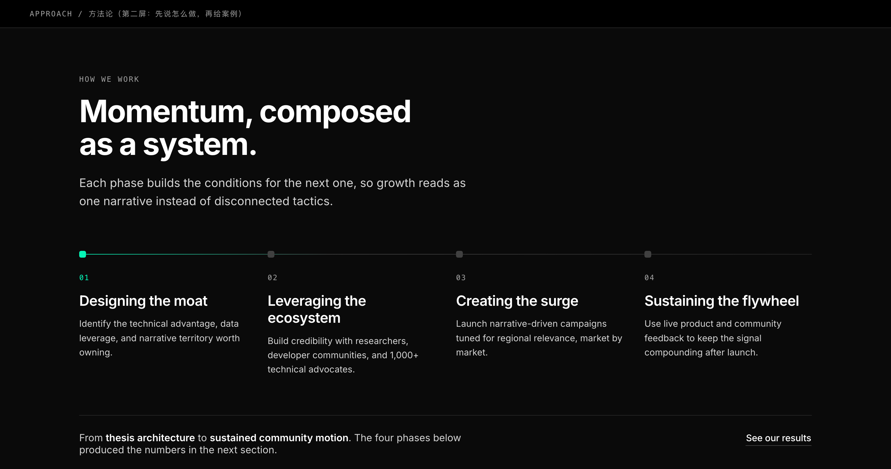

**为什么放在案例之前**

B2B 买家的判断顺序是固定的两步：**先看"这家懂不懂我的问题"，再看"他们做过没有"**。方法论回答第一个，案例回答第二个。顺序反过来，数字就变成了没有解释的数字。

这也是同类站的实际做法：

| 站 | 案例之前放的是什么 |
|---|---|
| **NoGood** | 六项服务概览，每项一句话 + 一个 CTA，然后才是案例卡 |
| **Attentive** | 产品价值主张，然后才是"来自领先品牌的真实成果" |

原站的 Approach 区块排在第 4 屏，案例排在第 9 屏，中间隔了领导层、服务、配图、地图四个区块，两者的因果关系被彻底切断了。

**改成什么**

四个阶段，但**不做成四张等大卡片**（那正是原站的毛病）。用**一条贯穿的水平线 + 四个节点**：

- 线从主色渐变到中性灰，视觉上就是"一个系统在往前推"，呼应你们自己的文案 "composed as a living system"
- 第一个节点用主色实心，其余中性
- 每个阶段 = 序号（等宽）+ 标题 + **一句话**，不超过 18 词
- 底部一句话把方法论和下一屏的案例连起来：`The four phases below produced the numbers in the next section.` 再挂一个 `See our results` 文字链

**文案沿用你们原有的四阶段**，只做压缩：

| 阶段 | 原文案 | 压缩后 |
|---|---|---|
| 01 Designing the moat | Identify the unique technical advantage, data leverage, and narrative territory worth building the brand around. | Identify the technical advantage, data leverage, and narrative territory worth owning. |
| 02 Leveraging the ecosystem | Build credibility with researchers, developer communities, and operators who can validate the signal early. | Build credibility with researchers, developer communities, and 1,000+ technical advocates. |
| 03 Creating the surge | Launch narrative-driven campaigns that make the company feel like the inevitable leader in its sector. | Launch narrative-driven campaigns tuned for regional relevance, market by market. |
| 04 Sustaining the flywheel | Use live product and community feedback to keep the story sharper, stronger, and more self-reinforcing over time. | Use live product and community feedback to keep the signal compounding after launch. |

原文那句 "make the company feel like the inevitable leader in its sector" 属于自我评价，换成了可验证的动作描述。

**参考**：**NoGood**（服务概览在前、案例在后）、**Attentive**（价值主张 → 客户成果的两段式）、Stripe（把复杂流程讲成一条线而不是一堆卡）。

---

## 6. Work 案例（每个都带三个数字）

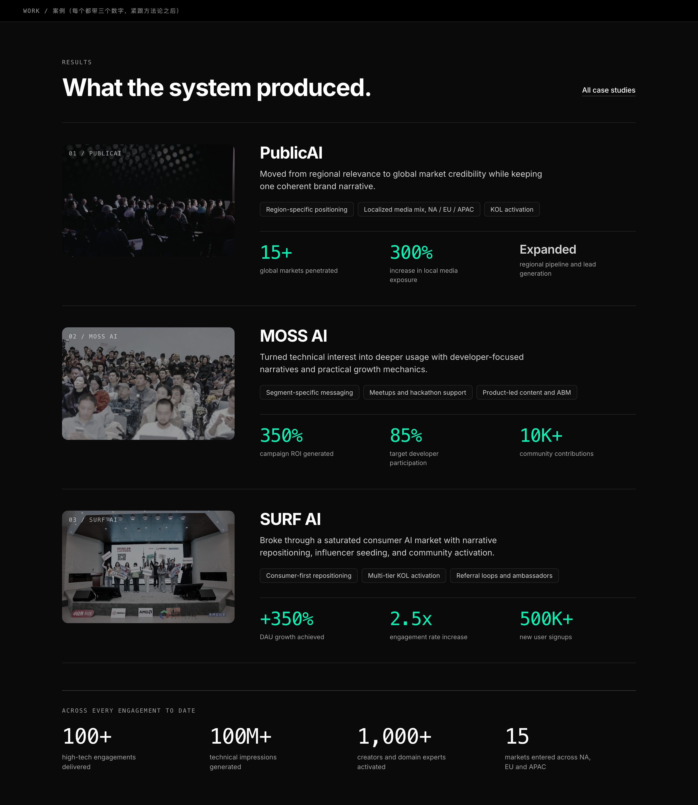

**改成什么**

上一版我做成了极简索引（一行一个案例，只带一个数字）。**按你的要求改回完整案例**，但结构重排：

```
[案例图 356×232]  |  客户名 34px
   序号叠在图上   |  一句话结果（不超过 22 词）
                 |  三个 chip：具体做了什么
                 |  ─────────────────────────
                 |  三个数字，等宽主色 38px
```

三个案例上下堆叠，细线分隔。hover 时其余两个降到 40% 透明度，当前案例的图轻微放大。

**三个数字全部用你们原有的数据**：

| 案例 | 数字 |
|---|---|
| PublicAI | `15+` 市场 / `300%` 本地媒体曝光 / `Expanded` 区域管道 |
| MOSS AI | `350%` 活动 ROI / `85%` 目标开发者参与 / `10K+` 社区贡献 |
| SURF AI | `+350%` DAU / `2.5x` 互动率 / `500K+` 新注册 |

**两个处理细节**

1. **数字用主色 + 等宽字，38px**。这是全页除了主标题之外最大的字号，因为这就是这一屏存在的理由。
2. **PublicAI 的第三格 `Expanded` 不是数字**，所以不给它数字的待遇：换成正文字体、25px、中性灰。三个格子里有一个是定性结果，如果排版一模一样会显得在凑数。

**原文案里的 bullet 变成 chip**。每条 bullet 原本 8-12 词，压成 3-5 词的标签：

| 原 bullet | chip |
|---|---|
| Research-based positioning for region-specific narratives | Region-specific positioning |
| Localized media mix across North America, Europe, and APAC | Localized media mix, NA / EU / APAC |
| KOL activation and sales enablement for regional teams | KOL activation |

信息还在，视觉成本降到五分之一。

**区块收尾：聚合数字行**

三个案例之后，用一条较粗的分隔线隔开，接一行 4 个聚合数字（`100+` / `100M+` / `1,000+` / `15`），小标签写 `Across every engagement to date`。

视觉上必须和案例数字**分层**：

| | 字号 | 颜色 | 含义 |
|---|---|---|---|
| 案例数字 | 38px 等宽 | **主色** | 具体成果，是这一屏的主角 |
| 聚合数字 | 44px 等宽 | **白色** | 总量，是收尾不是主角 |

字号更大但颜色更弱，读起来是"总结"而不是又一组要逐个消化的数据。

**参考**：**NoGood**（每张案例卡都被一个巨大的增长数字压住）、**Attentive**（左图右数据，数字比描述大得多）、Locomotive（hover 时其余项降透明度）。

**区块标题改成 `What the system produced.`**，小标签是 `Results` 而不是 `Work`。这一句直接承接上一屏的方法论：上面讲系统，这里讲系统产出了什么。

**⚠ 素材缺口（P0）**：**3 张案例图**，每个客户一张，1600×1000。示例图里 PublicAI 用的是图库照片、MOSS 和 SURF 用的是你们现有的活动照顶替，都不是真实案例素材。

---

### 关于证言：已按你的要求删除

原第 6 节的独立证言区块已经拿掉了。

但有一点要提醒：**你参考的 NoGood，它的案例卡里是内嵌证言的**：每张卡 = 客户 logo + 一句具名高管引言 + 头像职位 + 巨大的增长数字。它不是"案例和证言二选一"，是"证言长在案例里"。

所以如果以后拿到了授权的客户证言，**最好的位置是塞进案例的一句话结果下面**，而不是重新开一个区块。现在的案例布局留了这个空间，加一段引言 + 署名不需要改结构。

你们 X 的置顶推文 "Voice of Trust" 里就有现成的客户反馈，需要的只是书面授权。


## 7. Services 服务

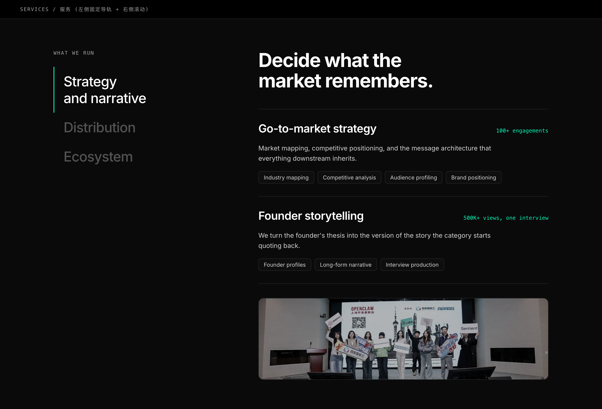

**现在的问题**

这是整页密度最失控的地方：**437 词**，6 个服务块，每块 = 一段 blockquote 引言 + 3 个 pillar 卡片，每个 pillar 里再嵌 3-4 条 bullet。一共 22 条 bullet、7 个 `detail-list`。

这是一份 PPT 被原样贴进了网页。

**改成什么**

**左轨 + 右滚动**（sticky rail）：

- 左侧 400px 固定：三个服务支柱 **Strategy and narrative / Distribution / Ecosystem**，33px，当前项亮起并带主色左边线，跟随右侧滚动切换。
- 右侧：当前支柱下的 2 个子服务，每个 = 标题 + **一句话**（不超过 22 词）+ 一行 chip 能力标签 + 右上角一个等宽字证据点（如 `100+ engagements`、`500K+ views, one interview`）。
- 底部接一张真实活动图收尾。
- 总词数从 437 压到 **约 140**。

**为什么**

- **6 个平级服务块 = 没有服务重点。** 收成 3 个支柱后，访客能记住的东西从 0 个变成 3 个。
- **bullet 列表是最懒的信息组织方式。** 22 条 bullet 没人会读。chip 标签能承载同样的关键词（对 SEO 也一样有效），但视觉成本只有五分之一。
- **左轨解决的是"深度"和"简洁"的矛盾**：内容还在，但一次只暴露一屏的量。这正是 Stripe 处理复杂产品线的做法。
- 每个子服务右上角挂一个真实数字，让服务描述不再是空承诺。

**参考**：**Stripe**（复杂服务的渐进披露：左轨 + 右滚动）、**NoGood**（六项服务各配一句话 + 一个 CTA，绝不展开成 PPT）、**Superside**（用交付物本身当视觉素材）。

---

## 8. Global Reach 全球版图

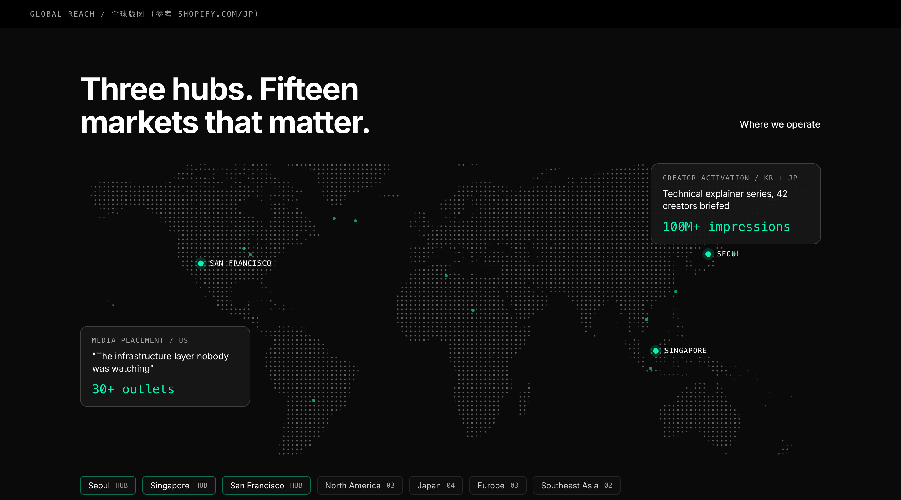

**现在的问题**（这是你们文档里点名要改的）

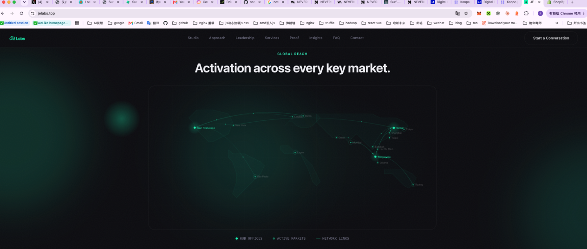

现在是一个 canvas 画的绿点连线图：对比度极低（在正常亮度屏幕上几乎看不见）、连线是纯装饰、下面挂一排图例（Hub offices / Active markets / Network links）。**它是一张为了有地图而存在的地图。**

**改成什么**

参考你们指定的 shopify.com/jp，核心不是"画一张更好看的地图"，而是 **在地图上叠真实业务对象**：

- 底图换成**点阵世界地图**（世界地图 SVG 做 mask，7.5px 点距的径向渐变做填充），中性灰 34% 不透明度。
- **只有 3 个 hub 用主色**：San Francisco / Seoul / Singapore，带 5px 主色光环。
- 叠 **2 张证据卡**，锚定在对应区域：一张媒体投放（`"The infrastructure layer nobody was watching" / 30+ outlets`），一张创作者活动（`Technical explainer series, 42 creators briefed / 100M+ impressions`）。这就是 Shopify 在地图上叠结账 UI 的同一手法。
- 底部图例改成**可交互的市场 chip 行**，hover 时高亮地图对应区域。

**为什么**

- 一张没有信息的地图只是装饰。**Shopify 那张地图之所以有说服力，是因为上面有真实的商品卡、货币和结账流程**，地图只是舞台。
- 3 个 hub 用主色、其余全中性，是让"全球覆盖"这件事在 0.5 秒内可读的唯一方法。现状里绿点绿线满屏，等于没有重点。
- 用 CSS mask 做点阵，比 canvas 逐帧绘制**省掉一整个 requestAnimationFrame 循环**，移动端不掉帧。

**参考**：shopify.com/jp（地图叠真实业务对象，你们自己的参考）、Stripe global、Cloudflare network map。

---

## 9. Studio 团队

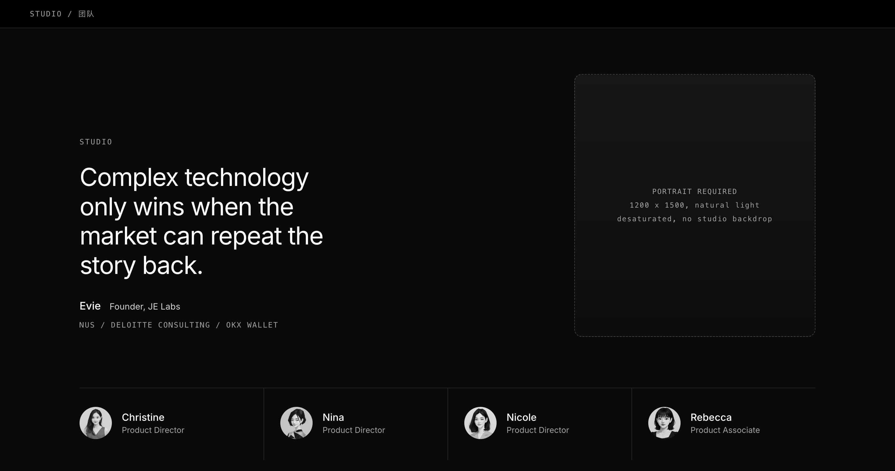

**现在的问题**

创始人卡片里塞了：badge（NUS / Deloitte / OKX）+ 一句 summary + 一句引言 + 3 个学历/履历块（每块 3 行）+ 3 个数据块。加上 4 张团队卡片，一共 87 词、12 个独立信息单元，**而且没有创始人本人的照片**。

**改成什么**

- 左侧：一句 40px 的**主张式引言**（`Complex technology only wins when the market can repeat the story back.`），署名 `Evie / Founder, JE Labs`，下面一行等宽字压缩全部履历：`NUS / DELOITTE CONSULTING / OKX WALLET`。
- 右侧：**创始人肖像**（示例图中标注为待补素材，含拍摄规格）。
- 底部一行：4 位团队成员的头像 + 姓名 + 职位，竖线分栏，hover 出社交链接。
- 删掉 3 个创始人数据块（10M+ / 20+ / 1M+）。它们和第 4 节的信任带重复。

**为什么**

- **人比履历表有说服力。** 三个学历块的信息量，一行等宽小字就装得下，省下来的空间给一张真人照片，可信度是净增的。
- 引言从"营销话术"（`Transforming complex technologies into market-dominating narratives`）改成一句**有观点的判断**，这是机构站建立专业感的标准做法。
- 数据不要在页面上出现两次。

**⚠ 素材缺口**：**创始人肖像照，1200×1500，自然光，低饱和，不要影棚背景纸。** 这是整个改版里优先级最高的一张素材。

**参考**：**Instrument**（人物影像的处理方式）、**DEPT**（Webby 2024/2025 年度网络，大机构如何用少量人物撑起专业感）、Work & Co 的团队页。

---

## 10. Insights 洞察

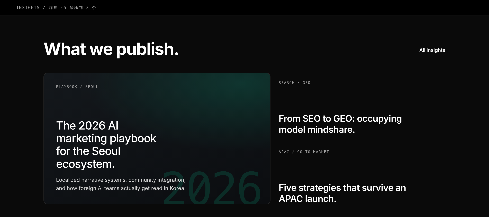

**现在的问题**

5 张卡片全是纯文字，一张 featured + 4 张普通，每张 30-40 词。144 词换来 5 个几乎无差别的灰盒子。

**改成什么**

- **5 条压到 3 条**，右上角 `All insights` 链接兜住其余。
- 左侧 featured 占 1.35 份宽度，用**巨型半透明数字 `2026` 做版式底纹**（不是图片，是排版元素），标题 + 两行摘要。
- 右侧两条走**极简列表**：等宽分类标签 + 标题，只用 1px 细线分隔，没有卡片、没有摘要。
- 标题重写得更短更有观点（`From SEO to GEO: occupying model mindshare.`）。

**为什么**

- 洞察区块的作用是"证明我们在思考"，不是"把文章目录搬过来"。**3 条够了**，多的靠链接。
- 一大两小的非对称布局，比 5 个等大卡片更容易建立层级。同时满足了 bento 的"格子背景要有差异"要求：featured 有渐变和排版底纹，右侧两条是纯文字。
- 现在这 5 条全部指向 X 的帖子，建议标题旁加 X 图标 + 日期，让访客知道点过去会看到什么。

**参考**：**NoGood**（洞察区块只放 3 条，每条都指向一个可下载物或线索表单）、**DEPT** 的 insight 栏目、Stripe Sessions 的编辑式排版。

---

## 11. 结尾 CTA + Footer

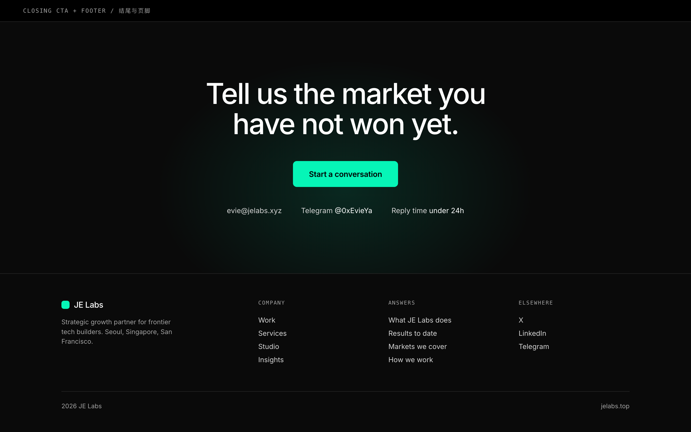

**现在的问题**

联系区是一个左文右链接的卡片，页脚只有两行字（`JE Labs` / `Strategic growth partner for frontier tech builders`）。对 SEO 和站内导航来说，这个页脚等于不存在。

**改成什么**

- **结尾 CTA 满宽居中**：一句 62px 的收束句 `Tell us the market you have not won yet.`（回扣首屏文案，形成闭环）+ 唯一主 CTA + 一行联系方式（邮箱 / Telegram / **回复时效 under 24h**）。光标光晕在这一屏再次生效。
- **真页脚**：4 栏（品牌简介 / Company / Answers / Elsewhere）。**Answers 一栏就是原来的 FAQ**，5 个问题变成 5 个页脚链接，`schema.org/FAQPage` 标记原样保留在折叠区里。

**为什么**

- 结尾 CTA 是全页转化率最高的位置，现在被做成了一张普通卡片。满宽 + 大字 + 单按钮是这个位置的正确形态。
- "under 24h" 这类**具体承诺**比 "Let's build the future with more clarity" 有效得多。
- 页脚是站内链接的分发器。两行字的页脚等于放弃了这一整块 SEO 权重。

**参考**：**NoGood**（页脚按 Services / Expertise / Insights 三栏组织，是站内链接分发器）、**Ramp**（结尾 CTA 满宽 + 单按钮）、DEPT footer。

**⚠ SEO 红线**：FAQ 的 `itemscope` / `itemprop` / `mainEntity` / `acceptedAnswer` 标记必须**一个字不改**地搬到页脚折叠区。这是现在唯一在生效的结构化数据。

---

## 12. 移动端

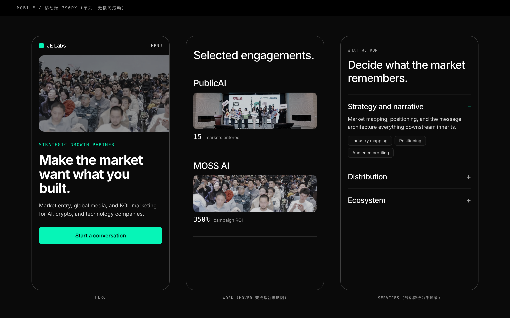

高 variance 的桌面布局在 768px 以下**必须全部塌成单列**：


| 桌面            | 移动 (390px)                         |
| ------------- | ---------------------------------- |
| 首屏左右分栏        | 图在上（216px 高）+ 文在下，标题降到 37px，CTA 满宽 |
| Work hover 揭图 | hover 不存在，缩略图**常驻**在每行标题下          |
| Services 左轨   | 降级为手风琴，默认展开第一项                     |
| 地图 + 证据卡      | 地图横向可拖，证据卡改成地图下方的堆叠卡               |
| 团队 4 栏        | 2×2 网格                             |


**为什么**：所有 `DESIGN_VARIANCE ≥ 4` 的不对称布局在移动端都必须无条件塌成 `w-full / px-20`。移动端不做减法，桌面端的所有非对称设计都会变成横向滚动条。

---

## 13. 光标特效（你们提的需求）

你们文档里第 1 条写的是"鼠标特效 welike 一致"，截图是一团跟随光标的薄荷绿光晕。

**规格**


| 参数   | 值                                               |
| ---- | ----------------------------------------------- |
| 直径   | 420px                                           |
| 颜色   | `rgba(6, 245, 183, 0.10)`，径向渐变到 62% 处透明         |
| 跟随   | lerp 系数 0.12（有拖尾，不是硬跟随）                         |
| 生效范围 | **只在首屏和结尾 CTA 两个区块**，中间区块不生效                    |
| 层级   | `pointer-events: none`，固定层，不放在滚动容器里             |
| 降级   | 触屏设备完全不渲染；`prefers-reduced-motion: reduce` 时不渲染 |


**为什么要限制范围**：光晕跟随全页会持续触发 GPU 重绘，移动端和低端笔记本会掉帧。只在首尾两屏生效，既拿到了"这个站有生命"的感受，又不付性能代价。

**实现红线**：**不要用 `window.addEventListener('scroll')` 或在 rAF 循环里改 React state**。用 CSS 变量 + `transform`，或者 Motion 的 `useMotionValue`。

---

## 14. 文案预算表

这是本次改版最硬的一条约束。每个区块给死字数上限：


| 区块             | 现状词数      | 预算          | 降幅            |
| -------------- | --------- | ----------- | ------------- |
| Hero           | 27（5 段）   | **30（4 段）** | 段落数 -20%      |
| 信任带            | 40        | **20**      | -50%          |
| Work 案例        | 195       | **40**      | **-79%**      |
| 证言 + 媒体覆盖      | 0         | **55**      | 新增区块          |
| Services       | 437       | **140**     | **-68%**      |
| Studio / 团队    | 87+120    | **35**      | **-83%**      |
| 全球版图           | 13        | **40**      | +（现在太少，需要证据卡） |
| Insights       | 144       | **60**      | -58%          |
| 结尾 CTA         | 48        | **25**      | -48%          |
| FAQ            | 324       | **324（不动）** | SEO 资产        |
| **合计（不含 FAQ）** | **1,287** | **约 445**   | **-65%**      |


页面高度：**14,272px → 7,572px（-47%）**。后一个数字不是估算，是把 `mock/full-page.html` 拼起来量出来的。

---

## 15. 信息架构对照


| #   | 现状顺序               | 新顺序                   | 变动                   |
| --- | ------------------ | --------------------- | -------------------- |
| 1   | Hero               | Hero                  | 重写                   |
| 2   | Stats strip        | 客户 logo 墙 + 数字        | 加 logo 墙             |
| 3   | Studio / manifesto | **Work 案例索引**         | **从第 9 位前移**         |
| 4   | Approach（4 步）      | Services（3 支柱）        | Approach 并入 Services |
| 5   | Leadership         | Global Reach          |                      |
| 6   | Services（6 块）      | Studio（含 Approach 观点） | 合并                   |
| 7   | 两张配图               | Insights              | 配图并入各区块              |
| 8   | Global Reach       | FAQ（页脚折叠）             | 下沉                   |
| 9   | **Proof（案例）**      | 结尾 CTA + 页脚           |                      |
| 10  | Insights           |                       |                      |
| 11  | FAQ                |                       |                      |
| 12  | Contact            |                       |                      |


12 个区块 → **9 个**。新顺序：Hero → **logo 墙** → **方法论** → **案例 + 聚合数字** → Services → 全球版图 → Studio → Insights → 结尾。

先说身份，再说怎么做，再给做出来的数字，最后才展开具体能力。

---

## 16. 必须补的素材清单

按优先级：


| 优先级    | 素材            | 规格                                | 用在哪                  |
| ------ | ------------- | --------------------------------- | -------------------- |
| **P0** | 创始人肖像         | 1200×1500，自然光，低饱和，无影棚背景纸          | Studio               |
| **P0** | 3 条客户证言       | 真名 + 职位 + 公司 + 书面授权，每条落在一个具体结果上   | 证言区块                 |
| **P0** | 3 张案例图        | 1600×1000，每客户一张                   | Work 索引 hover        |
| **P1** | 首屏主图无水印版      | 现有 `developer-activation` 右下有百度水印 | Hero                 |
| **P1** | PublicAI logo | SVG                               | 信任带（现在只能用文字代替）       |
| **P2** | 2-3 张现场补充图    | 1600×1000                         | Services 收尾、Insights |


**不要用图库图。** 你们做的是真实活动、真实投放，实拍照片的可信度是图库图给不了的。

---

## 17. SEO 迁移红线

改版最大的风险不在视觉，在这里。以下**一律不动**：

1. **URL 和路由**：单页站，只有 `/`，不动。
2. **锚点 ID**：`#studio` `#approach` `#leadership` `#capabilities` `#proof` `#insights` `#faq` `#contact` 全部保留，即使导航 label 改了。
3. **FAQ 结构化数据**：`schema.org/FAQPage` 的全部 `itemprop` 标记原样搬运。
4. `**llms.txt` / `sitemap.xml` / `robots.txt`**：同步更新区块名称。
5. **meta title / description / OG**：不在本次改版范围内，除非单独评审。
6. `**vercel.app` → 主域的重定向**：已在 `vercel.json` 里，保持。
7. **FAQ 的 324 词正文一个字不删**：它是全站唯一有实质长文本的 SEO 资产。

### 顺带要修的品牌一致性问题

和 SEO 无关，但属于同一批"上线前必须清掉"的清单：


| 问题             | 现状                                                                  | 应改为                                              |
| -------------- | ------------------------------------------------------------------- | ------------------------------------------------ |
| 主色 hex 不统一     | jelabs.top `#00f5b8`、WeLike `#06f5b7`、WeLike 内部 `kol-brand #2EDBA4` | 全部收敛到 `**#06f5b7`**（`kol-brand` 由 WeLike 那边单独排期） |
| OG 卡片配色        | `assets/og-image.png` 用的是旧绿                                         | 用新主色重出                                           |
| favicon / logo | 同上                                                                  | 确认导出色值与 `#06f5b7` 一致                             |


---

## 18. 落地节奏

按 `design-taste-frontend` 的现代化杠杆顺序，从低风险到高风险：


| 阶段    | 内容                                                                                      | 风险  | 见效  |
| ----- | --------------------------------------------------------------------------------------- | --- | --- |
| **1** | 接入品牌核：字体换 Inter、主色统一 `#06f5b7`、灰阶换 `surface-`*、去外发光、圆角统一 12/8/6、补齐对比度与 12px 底线、区块留白 160 | 低   | 高   |
| **2** | 文案裁剪：按第 14 节的预算表砍到 390 词，暂不动结构                                                          | 低   | 高   |
| **3** | Header + Hero 重构                                                                        | 中   | 最高  |
| **4** | Work 前移 + 索引化；Services 收成 3 支柱左轨                                                        | 中   | 高   |
| **5** | 地图重做、Studio 重组、Insights 压缩、页脚重建、**新增证言区块**（等证言采集齐）                                      | 中   | 高   |
| **6** | 动效层：滚动揭示、hover 揭图、光标光晕、视差                                                               | 低   | 中   |


**阶段 1 + 2 单独上线就能拿到这次改版约 60% 的观感提升**，而且几乎不动 DOM 结构，回滚成本极低。建议先做这两步验证方向，再推 3-6。

---

## 附：以后想做差异化的话

采用共享品牌核之后，JE Labs 首页和 WeLike 会长得很像同一家公司，这正是目的。代价是：**Inter + 黑底 + 青绿，是现在全球 AI 公司用得最多的一套组合**，你们和竞品在 Twitter 卡片、搜索结果缩略图这种小尺寸场景里不容易分开。

如果以后想拉开差距，只有一条正确路径：**改共享层，两边一起改**，不要 JE Labs 单飞。

两个可动的方向，按风险从低到高：

1. **只换 display 字面**（风险低）。正文继续 Inter，大标题换一个更有性格的无衬线。WeLike 的 skill 里本来就预留了 `font-outfit` 这个"仅标题"槽位（现在被 `globals.css` 别名成 Inter 了），把它启用并同步给两边即可。这是性价比最高的一步。
2. **换色相家族**（风险高）。比如深墨绿底 + 米白正文 + 单一橙色强调。这要重做 logo 配色，属于 rebrand，两个产品加上所有物料一起换。

两条都不在本次重构范围内。要做的话我可以单出一版，但前提是 WeLike 那边同步排期。

---

**文件清单**

```
artifacts/homepage-redesign-v2/
├── JE-Labs-首页重设计-v2.md    ← 本文
├── img/                        ← 全部示例图（1440px @2x 实渲）
│   ├── 00-system.png  ~  10-mobile.png
│   └── before-*.png            ← 现状对照
├── mock/
│   ├── full-page.html          ← 【总览】9 个区块拼成的完整首页，浏览器直接打开
│   ├── base.css                ← 设计系统 token（= WeLike 品牌核）
│   └── 00 ~ 11 .html           ← 分区块源文件，可直接改
├── render.sh                   ← 重渲某个区块图: ./render.sh 02-hero 900
└── build-full.py               ← 改完分区块后重新拼总览页: python3 build-full.py
```

**总览页怎么看**

```bash
open /Users/zheng/Documents/GitHub/JE/artifacts/homepage-redesign-v2/mock/full-page.html
```

按 1440px 宽设计，窗口拉到 1440 以上看最准。可交互的部分：导航吸顶、Work 三行 hover 出图、Services 左轨吸附滚动。页面底部有一条 `APPENDIX` 分隔线，线以下是设计系统、Header 对照和移动端稿，**不属于首页内容**。